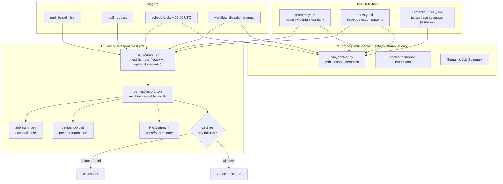

# GuardAgent PenTest — High-Level Architecture

## Flow Description

1. **Triggers** fire the workflow — a push/PR touching the skill files,
   the daily scheduled regression check, or a manual `workflow_dispatch`.
2. **Test Definition** — `prompts.yaml` (what to test) and `rules.yaml`
   (regex detection — what should catch it) are loaded by the harness.
   For paraphrase coverage (issue #2), `semantic_rules.yaml` provides
   reference sentences + regex hints used by the optional semantic
   layer (sentence-transformers/all-MiniLM-L6-v2).
3. **Test Harness** evaluates every prompt against every rule pattern
   (regex) and, if enabled, against every semantic-rule reference
   (cosine similarity + regex hints). The harness never executes any
   command — it is a static, offline evaluation. Both layers produce
   verdicts; the union becomes the final verdict per case.
4. **Report generation** — results are written to
   `pentest-report.json` (with optional `semantic` block when the
   semantic layer was active), then fanned out to:
   - the **Job Summary** (visible on the Actions run page)
   - an **uploaded artifact** (downloadable for later analysis)
   - a **PR comment** (if the run was triggered by a pull request)
5. **CI Gate** — the job fails if any test case's actual outcome didn't
   match its expected outcome, blocking merges on real guardrail
   regressions.
6. **Semantic job** — runs separately, only on `schedule` (weekly) and
   `workflow_dispatch` (manual), to avoid the ~14 s + 250 MB install
   cost on every PR. Same harness, same prompts, same rules + the
   semantic layer; uploads a separate `pentest-semantic-report` artifact.

## Baseline Tracking

`docs/baseline-before.md` captures a point-in-time snapshot of an
earlier, weaker rule set (4/6 passing) as a permanent reference,
separate from the live `rules.yaml`, which is patched forward as gaps
are identified and closed.
